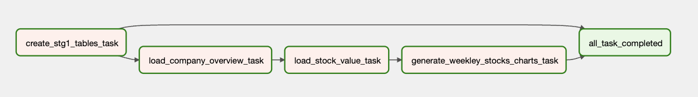
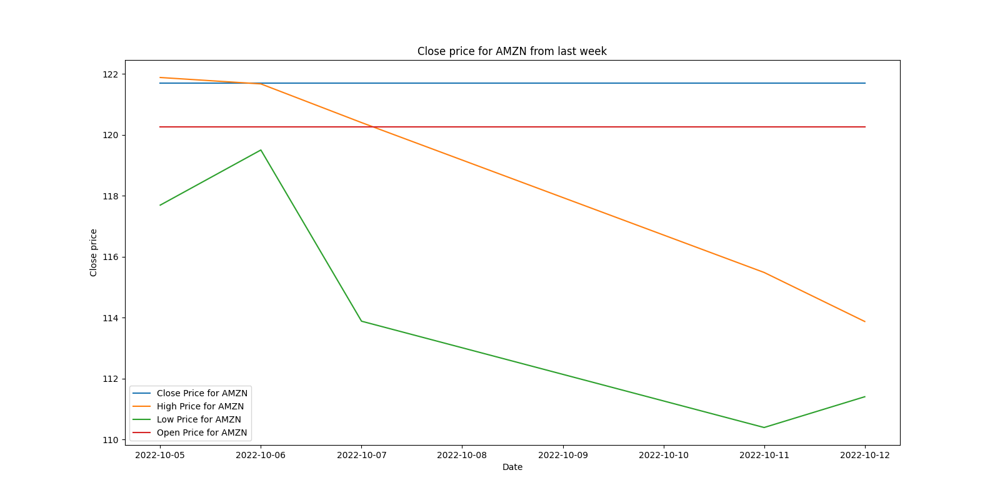
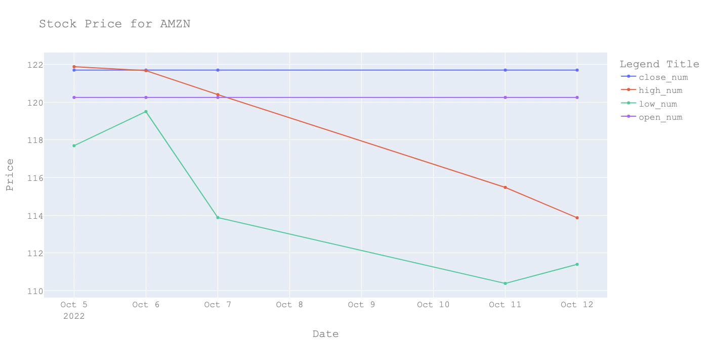
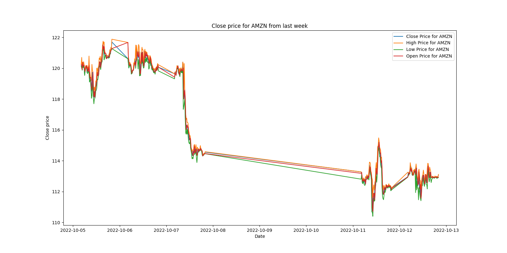
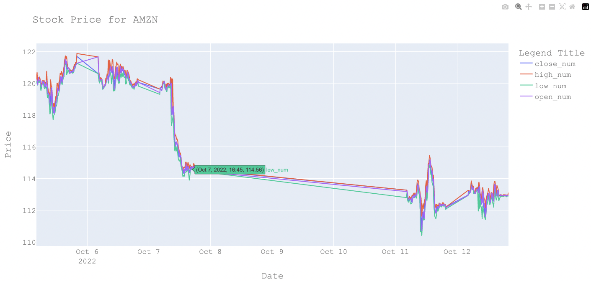

# Stock Price Tracking Data System

Data pipeline system project for stock price tracking.

The system uses Airflow to execute daily processes that take information about the stocks configured to be tracked and generate charts with the information about the daily values.
    

## Table of Contents
- [Project Structure](#project-structure)
- [Table of Contents](#table-of-contents)
- [Docker](#docker)
- [Airflow](#airflow)
- [PostgreSQL](#postgresql)
- [DAG](#dag)
- [Reports](#reports)
- [How to run the project](#how-to-run-the-project)

## Project Structure

```
.
|-- README.md
|-- dags
|   |-- __init__.py
|   |-- create_tables.py
|   |-- database
|   |   |-- __init__.py
|   |   |-- database.py
|   |   `-- models.py
|   |-- fetch_stocks_data.py
|   |-- get_api_data.py
|   |-- get_companys_overview.py
|   |-- get_stocks_prices.py
|   `-- stocks_extract_load_report_dag.py
|-- data
|   |-- examples
|   |   |-- AMZN_daily_2022-10-12.html.png
|   |   |-- AMZN_daily_2022-10-12_chart.png
|   |   |-- AMZN_detailed_2022-10-12.html.png
|   |   `-- AMZN_detailed_2022-10-12_chart.png
|   |-- raw
|   |   `-- 2022-10-14_stocks.json
|   |-- reports
|   `-- stocks_list.txt
|-- docker
|   |-- docker_postgres_init.sh
|   `-- docker_postgres_init.sql
|-- docker-compose.yaml
|-- logs
|-- plugins
|-- requirements.txt
`-- tests
    |-- __init__.py
    |-- __pycache__
    |-- mocks
    |   |-- __init__.py
    |   |-- db_mock.py
    |   `-- extract_mock.py
    |-- raw
    |   `-- 2022-10-14_stocks.json
    |-- test_extraction.py
    `-- test_fetch_data.py
 ```   

## Docker
The docker-compose file contains the following services:
- Postgres
- Airflow
- Airflow Worker
- Airflow Flower
- Redis
- Celery

## Airflow
In the Airflow folder there are the following dags:
- dags
    - stocks_extract_load_report_dag.py
    

## PostgreSQL
The Postgres database contains the following tables:
- stock_value:
    - The stock prices
- company_overview
    - Company overview, including its symbol

## DAG
The DAG is composed of the following tasks:
- create_stg1_tables_task
- load_company_overview_task
- load_stock_value_task
- generate_weekley_stocks_charts_task
- final_step


###




## Reports
The reports generated (path: /data/reports ) are devided into two categories:

- Daily values for each tracked stock.
    - {symbol}\_daily\_{date}_chart.png

    

        
    - {symbol}\_daily\_{date}.html
    
    

- Information colected every 15min for each tracked stock.
    - {symbol}\_detailed\_{date}_chart.png

    

    - {symbol}\_detailed\_{date}.html

    

## How to run the project
1. Clone the repository
2. Copy the .env.example file to .env
3. Fill the .env file with the correct values
    
    - For the API_KEY you need at least 3, you can get them from [Alpha Vantage](https://www.alphavantage.co/support/#api-key).
4. Open the terminal and run the following command:
```
docker-compose up -d
```
5. Open the browser and go to the following link:
```
http://localhost:8080
```
5. Enable the DAG
6. Click on the DAG and go to the Graph View

## How to stop the project
1. Open the terminal and run the following command:
```
docker-compose down
```
